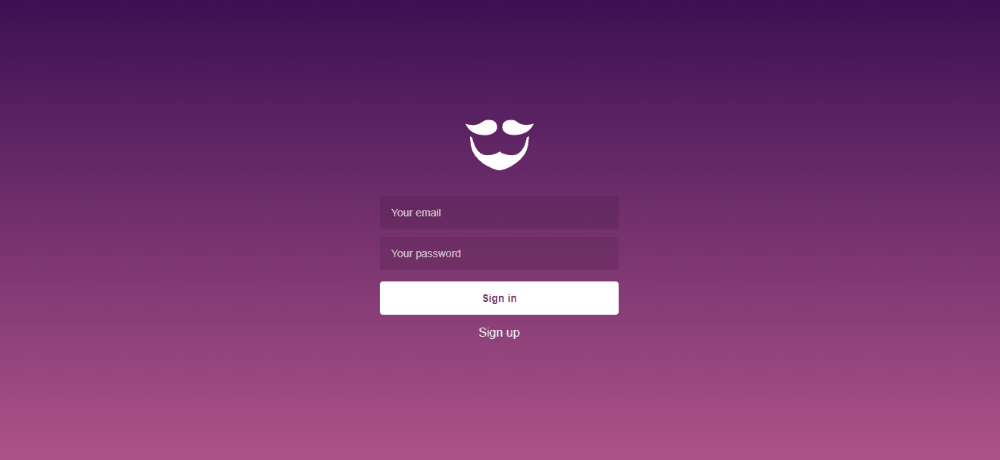

<h1 align="center">Welcome to GoBarber 💈</h1>

  
  
  

> This project is a barber calendar scheduler made on GoStack bootcamp. It consists in a system made of three parts: the mobile app made with React Native, which allows users to search for a professional, search for available time for schedule, schedule it, and if the client can't attend to it after the schedule he can cancel the appointment. The web app made with ReactJS, which allows professionals to follow his schedule and change its profile picture so the clients will be able to recognize him more easily. The backend made with NodeJS, which manages all kind of profiles with JWT authentication, any schedule conflicts and other business rules.

## Web App

## Mobile app (coming soon)

## Getting started

To run this project locally follow the instructions inside each project:

- [backend](https://github.com/LucasE2996/gobarber/tree/master/backend)
- [frontend](https://github.com/LucasE2996/gobarber/tree/master/frontend)
- [mobile](https://github.com/LucasE2996/gobarber/tree/master/mobile)

## Author

👤 **Lucas Rosa**

* Website: https://codepen.io/Lucas-Rosa/
* Twitter: [@lucashtwt](https://twitter.com/lucashtwt)
* Github: [@LucasE2996](https://github.com/LucasE2996)

## Show your support

Give a ⭐️ if this project helped you!

***
_This README was generated with ❤️ by [readme-md-generator](https://github.com/kefranabg/readme-md-generator)_
